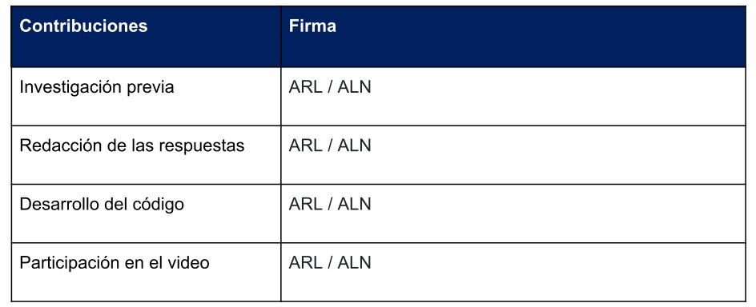

```{r setup, include=FALSE}
knitr::opts_chunk$set(echo = TRUE)
```

```{r include=FALSE}
# importamos las librerías que utilizaremos a lo largo de la PRA
if(!require(dplyr)){
  install.packages("dplyr")
  require(dplyr)
}

if(!require(multiUS)){
  install.packages("multiUS")
  require(multiUS)
}

if(!require(ggplot2)){
  install.packages("ggplot2")
  require(ggplot2)
}

if(!require(knitr)){
  install.packages("knitr")
  require(knitr)
}
if(!require(corrplot)){
  install.packages("corrplot")
  require(corrplot)
}
```

# 1. Descripción del dataset

En la PRA1 realizamos web scraping al portal web inmobiliario Fotocasa.es con el objetivo de obtener toda la información posible sobre el mayor número de viviendas en venta del municipio de Vilanova y la Geltrú. En esta segunda PRA nos ocupamos de procesar y analizar los datos obtenidos.

El problema principal que nos ocupa es explicar el comportamiento del precio en función de diferentes variables, que nos permitirá responder a preguntas como: ¿según incrementan los metros cuadrados de la propiedad, lo hace también el precio? ¿Influye el tipo de inmueble (piso, casa, chalet) sobre el precio? ¿Podemos ajustar un modelo de predicción de precios con los datos disponibles? 

Para responder a estas preguntas disponemos del dataset `output_fotocasa.csv`, con un total de 1097 registros y 15 variables. Si bien es probable que la cantidad de datos disponible será un factor limitante para la calidad del modelo, creemos que es suficiente para descubrir relaciones de interés entre las variables a través del análisis estadístico, de forma que el trabajo aquí desarrollado podría ser utilizado como base de un nuevo proyecto de web scraping cuyo objetivo fuera un modelo de predicción de precios de mayor escala.

# 2. Integración y selección

La fase de integración de datos, entendida ésta como la combinación de información procedente de diversas fuentes, es inexistente en este proyecto dado que contamos con un único archivo .csv resultante de la PRA1. Por tanto, pasamos directamente a la carga en memoria del fichero y la fase de selección:

```{r message= FALSE, warning=FALSE}
fotocasa.df <- read.csv('../output_fotocasa.csv')
```

Con la función `summary()` comprobamos que todos los datos importados tienen la misma longitud y que son del mismo tipo, en este caso del tipo carácter.

```{r message= FALSE, warning=FALSE}
summary(fotocasa.df)
```

A priori, las columnas "info_card_type" y "link" no son relevantes para los análisis que tenemos en mente. La primera representa un etiquetado interno de los contenedores HTML por propiedad según la cantidad de información que se muestra en la tarjeta resumen de la propiedad, mientras que la segunda representa la URL completa de la propiedad en cuestión.

Esta segunda variable es útil para llevar a cabo un test rápido de integridad: si tenemos links duplicados, significa que tenemos registros duplicados. Verifiquemos:

```{r}
length(fotocasa.df$link) == length(unique(fotocasa.df$link))
```

Comprobamos que los registros son únicos. Eliminamos las columnas:

```{r}
fotocasa.df <- select(fotocasa.df, -c(info_card_type, link)) 
```

Operaciones de selección más detalladas requerirán un tratamiento más sistemático de los datos: cambios de formato, extracción de información relevante de variables de texto, análisis de proporciones de valores NA, etc. Por ello, las aplazamos al apartado 3.

# 3. Limpieza de datos

## 3.1. Preprocesamiento y gestión de valores nulos

Primero, nos ocupamos de las operaciones de cambio de formato de `character` al tipo más adecuado para la variable en cuestión. Las columnas "rooms", "bathrooms", "price" y "surface" se deben transformar en valores numéricos ya que representan, respectivamente, el número de habitaciones, el número de cuartos de baño, el precio o los metros cuadrados que tiene la vivienda en cuestión. Para ello, extraemos los números de sus columnas y los transformamos mediante la función `as.numeric()`:

```{r message= FALSE, warning=FALSE}
fotocasa.df$rooms <- substr(fotocasa.df$rooms, 0, 1)
fotocasa.df$rooms <- round(as.integer(fotocasa.df$rooms))
```

```{r message= FALSE, warning=FALSE}
fotocasa.df$bathrooms <- substr(fotocasa.df$bathrooms, 1, 1)
fotocasa.df$bathrooms <- as.numeric(fotocasa.df$bathrooms)
```

```{r message= FALSE, warning=FALSE}
fotocasa.df$price <- sub("*.\200","",fotocasa.df$price)
fotocasa.df$price <- gsub("\\.","",fotocasa.df$price)
fotocasa.df$price <- as.numeric(fotocasa.df$price)
```

```{r message= FALSE, warning=FALSE}
fotocasa.df$surface <- gsub(" .*$","",fotocasa.df$surface)
fotocasa.df$surface <- as.numeric(fotocasa.df$surface)
```

Por otra parte, las columnas "parking", "balcony", "terrace", "elevator", "heating", "swimming_pool" y "air_conditioner" se pueden transformar en variables booleanas con tal de facilitar el posterior análisis. Para ello utilizaremos la función `as.logical()`. Si la columna viene informada, quiere decir que la vivienda cuenta con la instalación específica:

```{r message= FALSE, warning=FALSE}
fotocasa.df$parking[fotocasa.df$parking == "Parking"] <- TRUE
fotocasa.df$parking[fotocasa.df$parking == ""] <- FALSE
fotocasa.df$parking <- as.logical(fotocasa.df$parking)
```

```{r message= FALSE, warning=FALSE}
fotocasa.df$balcony[fotocasa.df$balcony == "Balcón"] <- TRUE
fotocasa.df$balcony[fotocasa.df$balcony == ""] <- FALSE
fotocasa.df$balcony <- as.logical(fotocasa.df$balcony)
```

```{r message= FALSE, warning=FALSE}
fotocasa.df$terrace[fotocasa.df$terrace == "Terraza"] <- TRUE
fotocasa.df$terrace[fotocasa.df$terrace == ""] <- FALSE
fotocasa.df$terrace <- as.logical(fotocasa.df$terrace)
```

```{r message= FALSE, warning=FALSE}
fotocasa.df$elevator[fotocasa.df$elevator == "Ascensor"] <- TRUE
fotocasa.df$elevator[fotocasa.df$elevator == ""] <- FALSE
fotocasa.df$elevator <- as.logical(fotocasa.df$elevator)
```

```{r message= FALSE, warning=FALSE}
fotocasa.df$heating[fotocasa.df$heating == "Calefacción"] <- TRUE
fotocasa.df$heating[fotocasa.df$heating == ""] <- FALSE
fotocasa.df$heating <- as.logical(fotocasa.df$heating)
```

```{r message= FALSE, warning=FALSE}
fotocasa.df$swimming_pool[fotocasa.df$swimming_pool == "Piscina"] <- TRUE
fotocasa.df$swimming_pool[fotocasa.df$swimming_pool == ""] <- FALSE
fotocasa.df$swimming_pool <- as.logical(fotocasa.df$swimming_pool)
```

```{r message= FALSE, warning=FALSE}
fotocasa.df$air_conditioner[fotocasa.df$air_conditioner == "Aire acondicionado"] <- TRUE
fotocasa.df$air_conditioner[fotocasa.df$air_conditioner == ""] <- FALSE
fotocasa.df$air_conditioner <- as.logical(fotocasa.df$air_conditioner)
```

Finalmente, nos ocupamos de las variables categóricas de varios valores: las columnas "floor" y "title", de la que podemos extraer información sobre las características generales de la vivienda. La conversión de "floor" es inmediata, para "title" debemos realizar algunas manipulaciones: extraemos mediante la función `gsub()` la primera palabra del texto, que siempre tiene valores como "Piso", "Ático", etc., y la almacenamos en la columna "tipo_vivienda" y la convertimos a variable categórica utilizando la función `as.factor()`. Finalmente, eliminamos la variable "title":

```{r}
fotocasa.df$floor <- as.factor(fotocasa.df$floor)
```


```{r message= FALSE, warning=FALSE}
fotocasa.df$tipo_vivienda <- gsub(" .*$","",fotocasa.df$title)
fotocasa.df$tipo_vivienda <- as.factor(fotocasa.df$tipo_vivienda)
fotocasa.df <- select(fotocasa.df, -title)
```

Ahora podemos ejecutar la función `summary()` para entender mejor el estado de nuestros datos:

```{r}
summary(fotocasa.df)
```

Llama la atención que existan un total de 984 NA's en la columna "bathrooms". Una inspección del fichero demuestra que no es un artefacto producido por el tratamiento de datos, si no que la variable no se capturó correctamente durante el proceso de web scraping. Esto puede ser debido a muchas razones: es posible que en el HTML de la página no se cargase esta variable pasado un cierto número de páginas, que tardase más que el tiempo de espera configurado por página o que se almacenase en contenedores diferentes. En todo caso, dado que el porcentaje de NA's de esta variable es del 89.7%, optamos por darla por perdida y eliminar la columna.

```{r message= FALSE, warning=FALSE}
fotocasa.df <- subset(fotocasa.df, select = -bathrooms)
```

Encontramos otro problema si observamos la variable "floor": contiene un total de 600 entradas en blanco, esto es un 55.7% del total. Dado el significado de esta variable, podríamos inferir que si está en blanco la propiedad es independiente y por tanto no debe ser registrada como un bajo o una primera planta. Sin embargo, si observamos los valores de "tipo_vivienda" para los registros donde "floor" no se encuentra informado, esta hipótesis no se sostiene:

```{r}
summary(fotocasa.df$tipo_vivienda[fotocasa.df$floor == ""])
```

Observamos un total de 222 propiedades catalogadas como "Piso" en las que no se ha informado la planta. La alta proporción de valores nulos y la falta de un criterio obvio de imputación indican que será mejor prescindir de esta columna para futuros análisis:

```{r message= FALSE, warning=FALSE}
fotocasa.df <- subset(fotocasa.df, select = -floor)
```

Respecto a la columna "tipo_vivienda", también notamos ciertas particularidades con sus valores:

```{r}
summary(fotocasa.df$tipo_vivienda)
```

La distribución de valores se halla muy concentrada en los valores "Piso" y "Casa", que comprenden el 87.1% del total de registros. Además de que su proporción es relativamente baja, estos registros son poco numerosos en términos absolutos, por lo que hacer estadística sobre ellos carece de sentido. Interpretamos que un "Ático" o una "Planta" son "Pisos", mientras que agrupamos el resto de tipos en el grupo genérico "Otros":

```{r}
levels(fotocasa.df$tipo_vivienda)[levels(fotocasa.df$tipo_vivienda)=="Ático"] <- "Piso"
levels(fotocasa.df$tipo_vivienda)[levels(fotocasa.df$tipo_vivienda)=="Planta"] <- "Piso"
levels(fotocasa.df$tipo_vivienda)[levels(fotocasa.df$tipo_vivienda)=="Apartamento"] <- "Otros"
levels(fotocasa.df$tipo_vivienda)[levels(fotocasa.df$tipo_vivienda)=="Dúplex"] <- "Otros"
levels(fotocasa.df$tipo_vivienda)[levels(fotocasa.df$tipo_vivienda)=="Estudio"] <- "Otros"
levels(fotocasa.df$tipo_vivienda)[levels(fotocasa.df$tipo_vivienda)=="Finca"] <- "Otros"
levels(fotocasa.df$tipo_vivienda)[levels(fotocasa.df$tipo_vivienda)=="Loft"] <- "Otros"
summary(fotocasa.df$tipo_vivienda)
```

Finalmente, observamos que en las columnas "rooms" y "price" tenemos un reducido número de valores faltantes: 90 en "rooms", 8.2% del total y 3 en "price", 0.2% del total. Debido a su baja incidencia, decidimos imputar los valores por knn. Podemos utilizar la función `impute.knn()` de la librería estándar de R. Dado que a estas alturas el dataset se encuentra bastante depurado y las incidencias de NAs restantes son relativamente bajas, invocamos la función con sus valores por defecto:

```{r}
fotocasa.df <- KNNimp(fotocasa.df)
summary(fotocasa.df)
```

Comprobamos mediante `summary()` que los valores faltantes han sido debidamente imputados. Finalmente, antes de proceder, debemos notar un último detalle sobre la imputación realizada: el clasificador de KNN entrenado no es adecuado para la imputación de variables categóricas, sean ordinales o nominales, dado que para el cálculo se utiliza la media de los k vecinos más cercanos. Ello resulta en valores no enteros sin sentido, como por ejemplo 2.77 habitaciones. Eliminamos esta situación redondeando los valores resultantes de la imputación a su valor entero más cercano:

```{r}
fotocasa.df$rooms <- round(fotocasa.df$rooms)
```

## 3.2. Gestión de valores extremos

Si observamos la salida de la función `summary()`, observamos que los valores máximos de las variables "price", "rooms" y "surface" son anormalmente grandes. Esto es un buen indicador de que pueden existir valores extremos, cuya presencia determinaremos con ayuda de la función `boxplot.stats()`, que nos permite localizar valores significativamente alejados de los rangos intercuartílicos, por defecto más de 1.5 veces el rango intercuartílico superior o inferior:

```{r}
boxplot.stats(x=fotocasa.df$price, coef=1.5)
```

Con la configuración por defecto, se detectan un total de 57 valores anómalos. Si observamos la salida de la función, el valor del bigote superior es de 620000. Alterar el valor del argumento `coef` nos permite observar la aparición y desaparición de valores anómalos. Se observa que salvo algunos valores que se encuentran cerca del bigote superior, como 660000 o 685000, existe un pequeño grupo de viviendas por encima de los 800000 que siempre son detectados como anómalos. Antes de tomar una decisión sobre qué hacer con estos valores anómalos, investiguemos su presencia en el resto de variables numéricas:

```{r}
boxplot.stats(x=fotocasa.df$rooms, coef=1.5)
```
Para el número de habitaciones observamos anomalías en ambas direcciones. Sin embargo, una vivienda de una habitación es fácil de imaginar: tal vez se refiera a aquéllas etiquetadas como "estudio" en "tipo_vivienda" o pisos pequeños; por otro lado, es probable que las viviendas de más de cinco habitaciones estén relacionadas con los registros de precios anormalmente altos. Comprobamos esta relación gráficamente:

```{r}
plot(x=fotocasa.df$price, y=fotocasa.df$rooms, main="Price vs. # of rooms", xlab="Price in €", ylab="# of rooms")
```

El gráfico demuestra que la relación planteada en el apartado superior no parece cumplirse en la realidad. La propiedad más cara de todas, con un precio superior a los 10 millones de euros, aparece listada con sólo dos habitaciones; también se observa una propiedad listada con una habitación que supera los dos millones de euros. Finalmente, evaluamos la variable "surface":

```{r}
boxplot.stats(x=fotocasa.df$surface, coef=1.5)
```

En el enlace https://www.arrevol.com/blog/cual-es-el-tamano-superficie-adecuado-minimo-necesario-de-una-casa-vivienda-piso-para-una-familia-de-4 se puede encontrar un artículo donde se estudia la superficie mínima de una vivienda de 4 personas. La conclusión del artículo es que unos $85m^2$ construidos deberían ser suficientes, y vemos que la media obtenida es de $102m^2$, que podríamos considerar en concordancia con el estudio. Los valores anómalos superiores muestran cifras enormes en algunos casos, como por ejemplo 1064, 2400 o 4400, que debemos imaginar que no se corresponden a metros totales construidos sino a la superficie de la finca en la que se encuentra la propiedad. Por otro lado, aunque no figura como valor anómalo, observamos que el mínimo de la variable es 1, un sinsentido. Exploremos la relación de esta variable respecto al precio y al número de habitaciones:

```{r}
plot(x=fotocasa.df$price, y=fotocasa.df$surface, main="Price vs. surface", xlab="Price in €", ylab="Surface in m^2")
```

Observamos de nuevo anomalías muy llamativas. La vivienda que cuenta con más de una hectárea ni se acerca al millón de euros, mientras que la propiedad cuyo precio ronda los 10 millones de euros es también una de las que tiene menor superficie en metros cuadrados. Cerca del cluster inferior izquierdo se puede inferir una cierta relación lineal, pero los valores que observamos fuera de este rango parecen difíciles de justificar.

Una vez realizado el análisis de valores extremos, procedemos a su tratamiento. Dado que el problema que queremos responder es la búsqueda de relaciones generales entre el precio y otras variables, consideramos que los registros que muestran comportamientos anómalos contribuyen negativamente a este objetivo y complican la imagen general que pretendemos obtener. Por ello, decidimos eliminar los registros según los siguientes criterios:

**Precio**: si el precio ha sido catalogado como anómalo por `boxplot.stats()`, lo eliminamos. Sólo unos pocos registros se encuentran cerca del valor del bigote superior, mientras que la mayoría de valores anómalos se encuentran muy por encima.

**Habitaciones**: si el registro tiene más de 6 habitaciones, lo eliminamos. Aunque 6 se encuentra catalogado como anómalo, su distribución de precios nos hace pensar que tiene un comportamiento relativamente normal. Existen muy pocos registros de más de seis habitaciones y todos ellos muestran relaciones complicadas con el precio.

**Superficie**: si el registro figura con 1 metro cuadrado o figura en la salida de `boxplot.stats()`, lo eliminamos. Hablamos de propiedades muy grandes, consideradas como el cuádruple o quintuple de lo que una familia de cuatro necesitaría y dado que en las variables que hemos extraído de Fotocasa no figura ninguna referencia a la presencia o no de jardín o si los metros cuadrados son construidos o totales, no tenemos forma de cuadrar estas observaciones con el resto.

```{r}
fotocasa.df <- fotocasa.df[!(fotocasa.df$price %in% boxplot.stats(x=fotocasa.df$price, coef=1.5)$out),]
fotocasa.df <- fotocasa.df[!(fotocasa.df$rooms > 6),]
fotocasa.df <- fotocasa.df[!(fotocasa.df$surface == 1),]
fotocasa.df <- fotocasa.df[!(fotocasa.df$surface %in% boxplot.stats(x=fotocasa.df$surface, coef=1.5)$out),]
```

Estas operaciones han resultado en una reducción del dataset de 1097 registros a 946, por tanto se ha eliminado un 14% de los registros por considerarlo anómalo. Aunque a priori esto pueda parecer una reducción muy grande en términos relativos, debemos tener en cuenta que muchos de los casos expuestos a lo largo de esta discusión son realmente difíciles de comprender: tal vez se trate de propiedades de ultralujo, superficies destinadas a usos comerciales, propiedades de alquiler listadas como propiedades en venta, etc. Dependemos en cierta medida de la moderación de Fotocasa, y quien haya utilizado cualquiera de estos portales podrá verificar que en muchas ocasiones se listan anuncios con características imposibles por error del anunciante o en ocasiones por estafas aún no reportadas.

Finalmente, observemos una vez más los gráficos producidos en este apartado para verificar si las relaciones se han visto alteradas ahora que hemos eliminado los valores considerados anómalos:

```{r}
plot(x=fotocasa.df$price, y=fotocasa.df$rooms, main="Price vs. # of rooms", xlab="Price in €", ylab="# of rooms")
```

```{r}
plot(x=fotocasa.df$price, y=fotocasa.df$surface, main="Price vs. surface", xlab="Price in €", ylab="Surface in m^2")
```

Podemos observar en el primer gráfico, por ejemplo, que la media del precio de los pisos listados con dos habitaciones es menor que la media de los pisos listados con cuatro habitaciones. En el segundo gráfico puede observarse cierta tendencia lineal, si bien con mucha dispersión, de la relación superficie-precio. Reservamos análisis en mayor profundidad para los apartados siguientes.

Ahora que los datos ya se encuentran en el formato adecuado, podemos pasar a analizar sus distribuciones en busca de valores faltantes o extremos y decidir qué hacer con ellos.

# 4. Análisis de los datos

## 4.1. Comprobación de la normalidad

Para comprobar la normalidad de las variables numéricas dentro del dataset utilizaremos en primer lugar la gráfica quantile-quantile y el histograma. Con la gráfica QQ podemos comparar los cuantiles de los datos observados con los cuantiles esperados bajo una distribución teórica específica. Si los dos conjuntos de datos siguen una misma distribución los puntos se distribuirán a lo largo de una recta. En el caso e seguir una distribución normal los conjuntos de datos se distribuirán a lo largo de una recta diagonal. Por ello, este tipo de gráficos es útil para comprobar la normalidad de las variables.

```{r ,eval=TRUE,echo=TRUE}
par(mfrow=c(3,2))
for(i in 1:ncol(fotocasa.df)) {
  if (is.numeric(fotocasa.df[,i])){
    qqnorm(fotocasa.df[,i],main = paste("Normal Q-Q Plot for ",colnames(fotocasa.df)[i]))
    qqline(fotocasa.df[,i],col="red")
    hist(fotocasa.df[,i], 
      main=paste("Histogram for ", colnames(fotocasa.df)[i]), 
      xlab=colnames(fotocasa.df)[i], freq = FALSE)
  }
}
```

Los resultados de las gráficas QQ nos indican que la variable precio podría ser candidata a seguir una distribución normal. Por otra parte, los datos de la variable "rooms" y "surface" se alejan significativamente de la diagonal con lo cuál probablemente no sigan una distribución normal.

Mediante el test de Shapiro comprobaremos finalmente el supuesto de normalidad de las tres variables.

```{r ,eval=TRUE,echo=TRUE}
shapiro.test(fotocasa.df$price)
```

```{r ,eval=TRUE,echo=TRUE}
shapiro.test(fotocasa.df$surface)
```

```{r ,eval=TRUE,echo=TRUE}
shapiro.test(fotocasa.df$rooms)
```

El test de Shapiro asume como hipótesis nula que la población está distribuida normalmente. Por lo tanto, cuando el valor p es menor que el nivel de significancia (normalmente $\alpha$=0.05), tenemos evidencias fuertes de que la hipótesis nula puede ser rechazada y en consecuencia, no podemos considerar que ninguna de las tres variables analizadas siga una distribución normal.

## 4.2. Comprobación de la homocedasticidad

La homocedasticidad debe ser comprobada por parejas de variables. Dado que la relación principal que queremos analizar en esta práctica es la del precio respecto al resto de variables y que ninguna de ellas puede ser supuesta como normal, hecho que implica que para todas las parejas deberíamos utilizar el test de Flignet-Killeen, sólo mostramos los resultados de la comprobación de la igualdad de las varianzas para las parejas "price"-"surface" y "price"-"rooms":

```{r message= FALSE, warning=FALSE}
fligner.test(price ~ surface, data = fotocasa.df)
fligner.test(price ~ rooms, data = fotocasa.df)
```

Aplicamos el test de Flignet-Killeen y vemos que no se cumple la homocedasticidad de los datos, puesto que las pruebas obtenidas tienen un p-valor inferior al nivel de significancia de $\alpha$=0.05.

## 4.3. Regresión lineal

Antes de aplicar una regresión lineal al conjunto de datos, con el objetivo de aproximar la relación de dependencia entre las variables "price" y "surface", veremos como están distribuidos los datos en el conjunto:

```{r message= FALSE, warning=FALSE}
table(fotocasa.df$rooms, fotocasa.df$tipo_vivienda)
```

Vemos que la mayoría de inmuebles son del tipo "Piso".

A continuación determinaremos las medias de los precios de las viviendas y de los metros cuadrados que tienen en función de las habitaciones. Además determinaremos el precio medio por metro cuadrado.

```{r message= FALSE, warning=FALSE}
aggregate(cbind(price, surface, "euros /m2" = price/surface) ~ rooms, 
          data = fotocasa.df, FUN = mean)
```

De la tabla de agregación vemos que el precio medio y la superficie media de las viviendas aumenta en función del número de habitaciones, cosa que parece lógica. Cabría mencionar, que en el caso de 6 habitaciones, tanto el precio medio de la vivienda como el número de metro cuadrados medio disminuye en comparación a los pisos de 5 habitaciones. Esto se debe probablemente a algún valor extremo y a la reducida cantidad de viviendas con tal número de habitaciones, lo cuál reduce la utilidad de la media calculada.

A continuación, realizaremos la misma agregación pero diferenciando en el grupo de datos según el tipo de vivienda:

Para el tipo de viviendas del tipo "Piso", las medias obtenidas son:

```{r message= FALSE, warning=FALSE}
pisos <- fotocasa.df %>% filter(fotocasa.df$tipo_vivienda == "Piso")
aggregate(cbind(price,surface, "euros / m2" = price/surface) ~ rooms, 
          data=pisos, FUN=mean)
```

Para el tipo de viviendas del tipo "Casa", las medias quedan de la siguiente forma:

```{r message= FALSE, warning=FALSE}
casas <- fotocasa.df %>% filter(fotocasa.df$tipo_vivienda == "Casa")
aggregate(cbind(price,surface, "euros / m2" = price/surface) ~ rooms, 
          data=casas, FUN=mean)
```

De las tablas de agregación expuestas anteriormente se identifica que la media por metro cuadrado disminuye para las viviendas del tipo "Piso", mientras que la media por metro cuadrado se mantiene relativamente estable para las viviendas del tipo "Casa".

A continuación nos centraremos en los pisos, para poder determinar si el precio de la vivienda se ajusta a una función lineal en función de la superficie del piso.

```{r message= FALSE, warning=FALSE}
# Seleccionamos solo los pisos
pisos <- fotocasa.df %>% filter(fotocasa.df$tipo_vivienda == "Piso")

# Convertir la variable rooms en factor
pisos$rooms <- factor(pisos$rooms)

# Definición de colores para el plot y creación del plot
colores <- c("blue", "red", "green", "orange", "yellow", "black")
ggplot(data = pisos, aes(x=surface, y=price, group=rooms, colour=rooms))+
  geom_point()+
  geom_smooth(method = "lm", se=TRUE) +
  labs(x = "Superficie",
    y = "Precio",
    title = "Relación precio por superficie")+
  scale_color_manual(values = colores)
```

Para poder establecer un modelo de regresión simple entre las dos variables en primer lugar separaremos los datos del dataset pisos en un dataset para entrenar el modelo y otro para testearlo.

```{r}
# Creación de la variable aleatoria
variable_aleatoria <- sample(nrow(pisos),2/3*nrow(pisos))
nrow(pisos)

# Creamos los dos datasets
pisos.entrenamiento <- pisos[variable_aleatoria, ]
pisos.test <- pisos[-variable_aleatoria, ]
```

A continuación creamos un modelo de regresión lineal a partir del cual queremos determinar el precio en función de la superficie del piso y entrenado a partir de los datos previamente seleccionados "pisos.entrenamiento".

```{r message= FALSE, warning=FALSE}
model <- lm(formula=price ~ surface, data=pisos.entrenamiento)
summary(model)
```

En este caso el coeficiente R^2 es relativamente bajo `r summary(model)$r.squared`

De todas formas, realizaremos una predicción del precio de los pisos en función de la superficie a partir del modelo conseguido. 

```{r message= FALSE, warning=FALSE}
# Predicción a partir del modelo model
estimated.price <- predict(model, pisos.test, type="response")

# Creación de un dataframe para la comparación entre la predicción y el valor real
results <- data.frame(pisos.test$price, predicted=estimated.price, dif=
                        (pisos.test$price-estimated.price)*100/pisos.test$price)
colnames(results)<- c("Real", "Predicho","Dif%")
kable(head(results, 10), format = "markdown")

# Obtención de la media del error
mean(abs(results$`Dif%`))
```

Visto que el modelo no es del todo bueno, al estar R^2 alejado de 1, realizamos un segundo modelo de regresión lineal. Tal y como hemos visto en una de las gráficas superiores, vemos que para los pisos de 1 habitación y de más de 4 habitaciones, la correlación lineal entre el precio prácticamente no existe. Por ello consideraremos para el siguiente modelo sólo los pisos de 2, 3 y 4 habitaciones.

```{r}
pisos2 <- pisos %>% filter(pisos$rooms == 2 | pisos$rooms == 3 | pisos$rooms == 4)

# Creación de la variable aleatoria
variable_aleatoria <- sample(nrow(pisos2),2/3*nrow(pisos2))

# Estructura de la variable
str(variable_aleatoria)

# Creamos los dos datasets
pisos2.entrenamiento <- pisos2[variable_aleatoria, ]
pisos2.test <- pisos2[-variable_aleatoria, ]
```

En este segundo modelo consideramos además otras variables como el parking, la piscina, la terraza y el balcón.

```{r message= FALSE, warning=FALSE}
model2 <- lm(formula=price ~ surface + parking + swimming_pool + terrace + 
               balcony, data=pisos2.entrenamiento)
summary(model2)
```

Vemos de los resultados que en este caso se ha mejorado ligeramente el valor R^2, ya que este es igual a `r summary(model2)$r.squared`. Estamos más interesados en conocer el peso relativo de cada una de las variables sobre el precio final del inmueble que en la creación de un modelo robusto, por tanto este valor debe ser tomado de una forma más bien anecdótica.

De los datos que obtenemos del modelo, resulta interesante valorar los coeficientes que obtenemos.

```{r message= FALSE, warning=FALSE}
coef(model2)
```

Notemos que el primer coeficiente que determina la relación entre la superficie y el precio igual a `coef(model2)$surface` es cercano a la media de los precios por metro cuadrado establecido anteriormente. Los otros coeficientes determinan en qué medida afectaría cada propiedad al precio de la vivienda. Resaltar por lo tanto que una plaza de parking tendría una mayor influencia según el modelo calculado.

Finalmente, realizamos una segunda predicción a raíz del segundo modelo calculado.

```{r message= FALSE, warning=FALSE}
estimated.price <- predict(model2, pisos2.test, type="response")
results2 <- data.frame(pisos2.test$price, predicted=estimated.price, dif= (pisos2.test$price-estimated.price)*100/pisos2.test$price)
colnames(results2)<- c("Real", "Predecido","Dif%")
kable(head(results2, 10), format = "markdown")
mean(abs(results2$`Dif%`))
```

Vemos que en este caso, la media del error entre los valores reales y el predicho disminuye ligeramente al aumentar la calidad del modelo de regresión lineal.

## 4.4. Correlación

Otro análisis que realizamos es el de la correlación entre diferentes variables. Para ello nos ayudamos de la función cor() en R. Al no cumplirse la condición de normalidad, como hemos visto antes, emplearemos el método de Spearman. Cabe mencionar que para ello sólo se consideran las variables numéricas dentro del dataset.

```{r message= FALSE, warning=FALSE}
fotocasa.df.num <- subset(fotocasa.df, select = c("price", "surface", "rooms")) 
cor(fotocasa.df.num, method="spearman")
```

Los resultados muestran que las variables precio y superficie y superficie y habitaciones tienen respectivamente una correlación cercana al 0,60.

## 4.5. Influencia del tipo de vivienda sobre el precio

Como parte de nuestro análisis, nos interesa comprobar si los precios son, en promedio, diferentes según el tipo de inmueble, cuyos valores posibles son "Piso", "Casa" u "Otros"; por tanto hablamos de una comparación entre más de dos grupos. Dado que ya hemos comprobado que la variable "price" no sigue una distribución normal mediante el test de Shapiro-Wilk, debemos utilizar la prueba del Kruskal-Wallis; sin embargo no está de más comprobar si existe heterocedasticidad para esta pareja de variables mediante el test de Fligner-Killeen:

```{r message= FALSE, warning=FALSE}
fligner.test(price ~ tipo_vivienda, data = fotocasa.df)
```

Observamos que el p-valor reportado de 0.79 es mucho mayor al nivel de significancia. Por tanto, no tenemos evidencias suficientes para rechazar la hipótesis nula y debemos asumir igualdad de varianzas entre los tres grupos. Ejecutando el test de Kruskal-Wallis, obtenemos:

```{r message= FALSE, warning=FALSE}
kruskal.test(price ~ tipo_vivienda, data = fotocasa.df)
```

En este caso observamos que el p-valor obtenido es mucho menor al nivel de significancia. Dado que la hipótesis nula de un test de Kruskal-Wallis es que no se observan diferencias entre los distintos grupos, el p-valor nos indica que tenemos pruebas para rechazar la hipótesis nula y concluir que existen diferencias significativas en el precio según el tipo de vivienda.

# 5. Representación gráfica de los resultados

Durante los capítulos anteriores se realizaron diversas representaciones gráficas con lo cuál en este apartado sólo realizamos la representación de los resultados de los 2 modelos de regresión lineal obtenidos.

```{r message= FALSE, warning=FALSE}
results$surface <- pisos.test$surface
ggplot() +
  geom_point(data = results, aes(surface, Real), color = "blue", size = 2) +
  geom_point(data = results, aes(surface, Predicho), color = "red", size = 2) +
  theme_minimal() +
  labs(x = "Superficie",
    y = "Precio",
    title = "Modelo 1: Precio - Superficie")
```

```{r message= FALSE, warning=FALSE}
results2$surface <- pisos2.test$surface
ggplot() +
  geom_point(data = results2, aes(surface, Real), color = "blue", size = 2) +
  geom_point(data = results2, aes(surface, Predecido), color = "green", size = 2) +
  theme_minimal()+
  labs(x = "Superficie",
    y = "Precio",
    title = "Modelo 2: Precio - Superficie")
```

Y además una representación gráfica de los valores de las correlaciones entre las variables:

```{r message= FALSE, warning=FALSE}
cor.mat <- round(cor(fotocasa.df.num),2)
corrplot(cor.mat, type="upper", order="hclust", tl.col="black", tl.srt=45)
```

# 6. Resolución del problema

A lo largo de la Práctica se han preparado los datos (selección, integración y limpieza) para posteriormente realizar diversos análisis con ellos. El enfoque principal ha sido identificar posibles correlaciones entre los diferentes parámetros que describen una vivienda. Se ha podido identificar una cierta correlación entre el precio de la vivienda y la superficie que tienen, no obstante esta correlación no ha sido tan elevada como hemos supuesto inicialmente.

Para determinar el precio de una vivienda además de la superficie y ciertas propiedades que hemos intentado considerar (como tener una piscina, una terraza o una plaza de parking) en nuestros análisis durante la práctica, también influyen otros factores que no se han podido evaluar. Estos factores, como podrían ser la edad de la vivienda o la localización tienen probablemente una mayor influencia, motivo por el cuál las correlaciones de los factores considerados son relativamente 

# 7. Contribuciones

